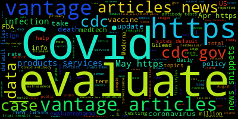

#trgn510_assignment2
##Word Cloud

*About the app
  * this web app will introduce everyday new data of COVID-19, which show the word cloud image of these reports.
  
*Installtion & Usage
  * we need to create a script called "generate_wordcloud_from_file.sh" 
  * get two erveyday update website, put them into "my_webpages.txt" file
  * with the dpendencies, edit the "generate_wordcloud_from_file.sh" to run the serve

*Dependencies
  * First
    * wget -O
      * download the content of html with speical file name
    * git clone https://github.com/aaronsw/html2text
      * download the html2text program
      * convert the html file to txt file
        * "html2text.py file1.html > my_current.txt"
          * use the command to append the txt to new txt file
    * git clone https://github.com/amueller/word_cloud.git
      * download the word-cloud program
      * python -m pip install --user wordcloud
        * we can install the wordcloud command locally
          * convert txt file to a word cloud image
          * wordcloud_cli --text my_current.txt --imagefile ~/public_html/myimage.png
  * Second
    * https://trgn.usc.edu/user/~lilixu
      * with in ~/public_html
        * it will contain our image file and index.html
        * with in html file, we can insert ** </img> **
    * cron 
      * this program can set up a schedule to run the script, which can keep to update my wordcloud image everyday 
      * contab -e
        * insert "0 7 * * * generate_wordcloud_from_file.sh"
      * contab -l
        * check current set up schedule
*Contact
  if you need any assistance of this app,
  you can contact following ways:
  Lili Xu
  Phone: 7143252421
  Email: lilixu@usc.edu
